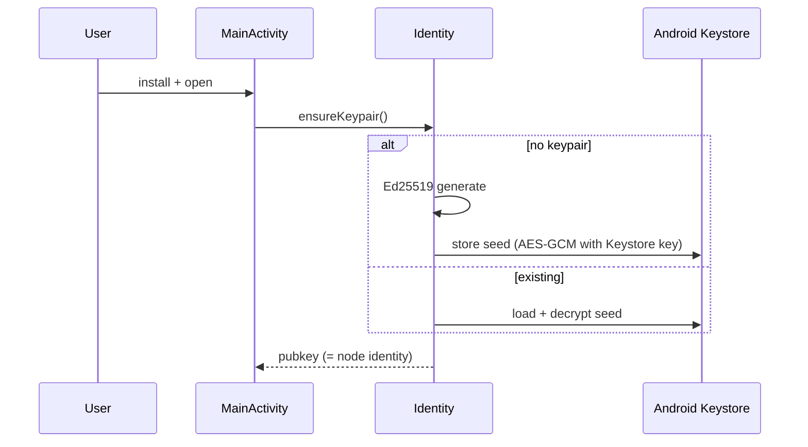
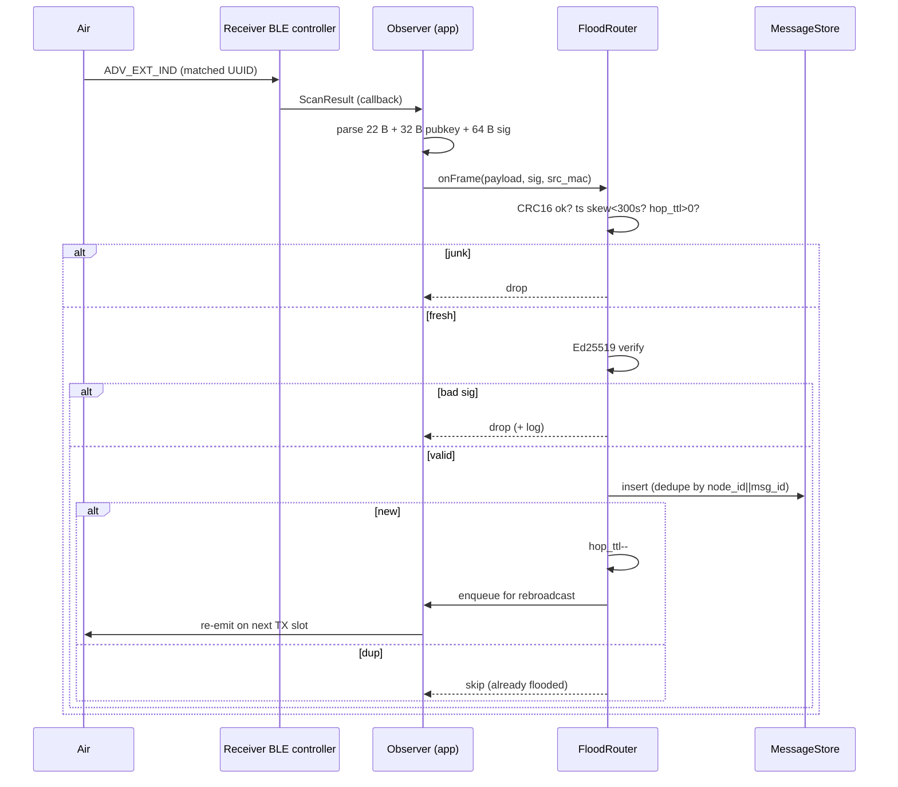
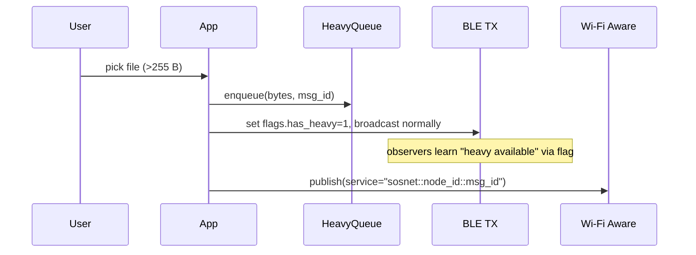
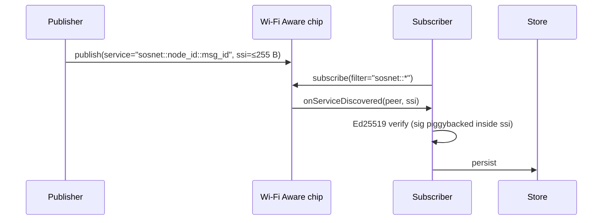
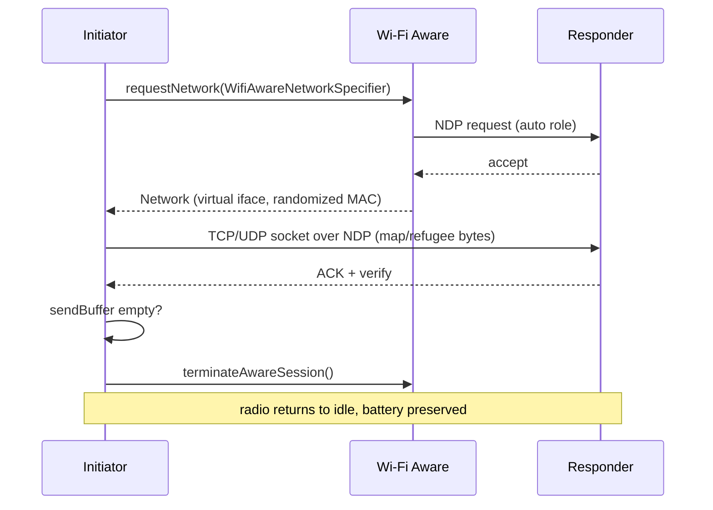

# SOSNet — Protocol Flows

> Connectionless L2 messaging mesh for SOS dissemination. No pairing, no handshake, no credentials exchange. Phones behave as radio beacons: they emit structured bursts and listen to what floats in the air.

Audience: dev team + hackathon jury. This document is the formal specification. Byte layout lives in [`payload-binary-layout.md`](payload-binary-layout.md); signature scope lives in [`crypto.md`](crypto.md).

---

## 1. Architecture

Two planes, both connectionless:

| Plane | Radio | Standard | Role | Payload size |
|---|---|---|---|---|
| Control | BLE | GAP Broadcaster / Observer | Always-on discovery + telemetry | 22 B payload + 32 B pubkey + 64 B signature |
| Data (light) | Wi-Fi Aware (NAN) | IEEE 802.11v Service Discovery Frame | Mid-size burst | ≤ 255 B |
| Data (heavy) | Wi-Fi Aware (NAN) | NAN Data Path (NDP) | File / map / list transfer | > 255 B |

Security is relocated from the link layer (which is intentionally open, public SOS) to the application layer via Ed25519 signatures. Tampering breaks the signature; the next hop drops the packet.

---

## 2. Flow 0 — Identity bootstrap

One-shot, on first launch. Generates a durable Ed25519 keypair. The public key (32 B) is the node's permanent identity; a 4 B truncated SHA-256 of it is carried in every frame as `node_id`.



**Acceptance**: subsequent launches load the same keypair; `node_id` is stable across re-installs of the same identity export.

---

## 3. Flow 1 — TX broadcast cycle (BLE Broadcaster)

Source phone packs GPS + status into 22 B, signs, and radiates the 118 B service-data block (22 B payload + 32 B pubkey + 64 B sig) via BLE 5 Extended Advertising (`ADV_EXT_IND`) on channels 37/38/39. No ACK, no handshake — pure unidirectional broadcast.

```mermaid
sequenceDiagram
  participant Src as Source phone
  participant BLE as BLE controller
  participant Air as 2.4 GHz (ch 37/38/39)
  Src->>Src: build 22 B payload (GPS + type + ts + msg_id)
  Src->>Src: sign → 64 B Ed25519
  Src->>BLE: AdvertisingSet.start(serviceData=[22 B][32 B pubkey][64 B sig])
  BLE->>Air: ADV_EXT_IND on ch 37, 38, 39 (rotation)
  note over Air: any Observer in range captures it; no ACK, no handshake
```

**Parameters**:

- Primary PHY: LE 1M. Secondary PHY: LE Coded (broadest receiver compatibility — some controllers ignore the 2M secondary PHY).
- Interval: `INTERVAL_LOW` (≈ 1 Hz). TX power: `TX_POWER_HIGH` (demo range).
- Connectable false, scannable false (no pairing, no scan-response).
- Hop TTL: 15 on origin (decremented at each retransmission).
- Custom 128-bit Service UUID — see [`payload-binary-layout.md`](payload-binary-layout.md).

**Acceptance**: `nRF Connect` on a second phone shows the Service UUID and decodes the 118 B service data. No pairing prompt appears at any point.

---

## 4. Flow 2 — RX observe + verify + flood (BLE Observer)

Software filter on the custom Service UUID in `ScanRecord` (no hardware `ScanFilter` — extended service-data is often dropped when filtering in silicon). Scan settings: `SCAN_MODE_LOW_LATENCY`, `legacy=false`, PHY default (`ALL_SUPPORTED`; controller enables 1M+Coded on QTI). On callback the app parses the frame, runs a cheap reject cascade, then the expensive Ed25519 verify, then dedupe + rebroadcast.



**Reject cascade** (cheapest first):

1. `CRC16 != expected` → drop.
2. `|ts_unix - now| > 300 s` → drop (replay / clock skew).
3. `hop_ttl == 0` after decrement → drop (max hops reached).
4. Ed25519 verify fails → drop.
5. Dedupe cache hit (`node_id||msg_id` seen within TTL window) → skip rebroadcast, but still consider it a confirmed receipt.

**Acceptance**: third phone (C) receives an SOS originated at A within `2 × T_adv` (≈ 2 s). Resend the same `msg_id` from A → B sees it once (dedupe hit logged).

---

## 5. Flow 3 — Heavy payload trigger

Origin sets `flags.has_heavy = 1` in the BLE ADV payload and queues the heavy bytes (map tile, refugee list, medical image) locally. The 6-byte correlation key `node_id || msg_id` from the BLE frame becomes the NAN service name hash on the data plane.



---

## 6. Flow 4 — NAN Service Discovery (≤ 255 B)

`WifiAwareManager.publish()` / `subscribe()`. The Service Specific Info (SSI) field carries the bytes directly inside a NAN Service Discovery Action Frame at the MAC layer. No IP, no auth, no user-facing pairing.



**Synchronization**: NAN chips align on Discovery Windows (typically 512 ms every ≈ 5 s). Publisher radiates during the window; subscribers' radios are gate-open during the same window.

**Acceptance**: send a 200 B blob → second phone receives within 3 s of discovery. No Wi-Fi settings prompt, no credentials.

---

## 7. Flow 5 — NAN Data Path (> 255 B)

When the payload exceeds 255 B, the chips coordinate a higher-throughput link via NAN Data Path (NDP). The Initiator/Responder role is auto-assigned by firmware. A virtual network interface with a randomized MAC is created; throughput reaches ≈ 50 Mbps. The interface is destroyed the instant the send-buffer drains.



**Acceptance**: send a 50 KB map tile → throughput ≥ 20 Mbps on mid-range phones; NDP session torn down ≤ 1 s after buffer drains (verified via `adb shell dumpsys wifi_aware`).

---

## 8. Flow 6 — Battery duty cycle

A foreground service (type `connectedDevice`) keeps BLE + Aware sessions alive in the background. Default schedule:

| Radio | Default | Rationale |
|---|---|---|
| BLE Observer | `SCAN_MODE_LOW_LATENCY`, `legacy=false`, software UUID filter | Extended ADV requires non-legacy scan; hardware filter drops service-data on some stacks |
| BLE Broadcaster | active only when local SOS OR flooded frame queued | Avoid beacon noise when nothing to say |
| NAN subscribe | passive (low duty) | Listen for heavy-payload publishers |
| NAN publish + NDP | only on `has_heavy` | Heavy radio reserved for heavy data |

**Acceptance**: phone screen off, app backgrounded 5 min → still receives a broadcast from a peer. Foreground notification visible throughout.

---

## 9. State machines

### BLE module

```
STOPPED ──▶ STARTED_ADVERTISING ◀──▶ STARTED_SCANNING
                       │                  ▲
                       └──(concurrent)───┘
```

Modern chips support simultaneous advertise + scan via `AdvertisingSet` + `ScanSet`.

### Aware module

```
IDLE
  └─ publish() ──▶ PUBLISHED ──▶ onServiceDiscovered ──▶ NEGOTIATING_NDP
                                                          │
                                                          ▼
                                                       NDP_OPEN
                                                          │
                                                          ▼
                                                       BUFFER_DRAINED
                                                          │
                                                          ▼
                                                       NDP_TORNDOWN ──▶ IDLE
```

### FloodRouter

```
IDLE ──▶ VERIFYING ──▶ DEDUPE_CHECK ──┬──▶ DROP ──▶ IDLE
                                       └──▶ ENQUEUE_REBROADCAST ──▶ IDLE
```

---

## 10. Why no pairing?

Pairing in classic Bluetooth / Wi-Fi serves two purposes:

1. Encrypt the link.
2. Establish trust in the other endpoint.

Our protocol discards both:

1. **The link is intentionally open.** This is a public SOS — anyone in range should be able to receive and relay it. Encryption at L2 would actively harm propagation.
2. **Trust is established at the application layer** via Ed25519 signatures. A frame is authentic if and only if its signature verifies against the origin's published pubkey; the radio that delivered it is irrelevant. Any phone can relay, none can forge.

This is the standard argument for moving authentication from the link to the payload. The tradeoff is intentional and is what enables the opportunistic, asynchronous, connectionless nature of the mesh.
